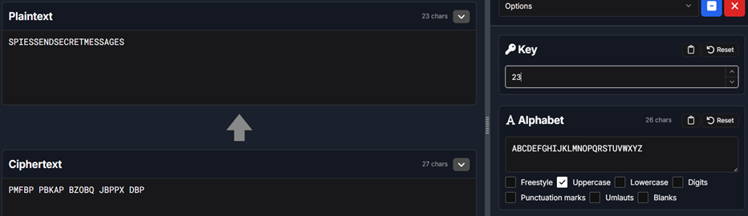
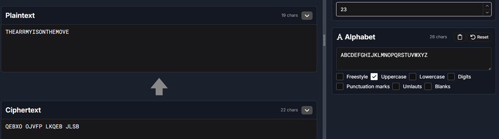
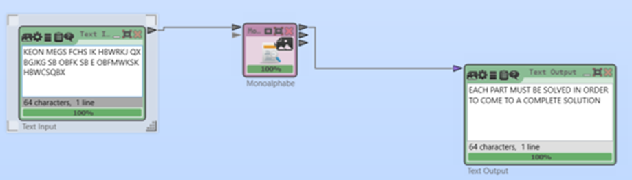
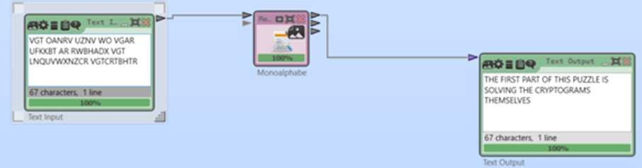

# Classical Cryptanalysis Lab - Cipher Decryption & AES Key Recovery

A hands-on cryptanalysis lab decrypting classical ciphers using frequency analysis, pattern recognition, and automated tools - progressing from Caesar shifts to monoalphabetic substitution ciphers, and concluding with an AES brute-force key recovery challenge.

---

## Objectives

- Identify cipher types from ciphertext characteristics
- Apply systematic cryptanalysis techniques (frequency analysis, IC, pattern recognition)
- Decrypt Caesar, Beaufort, and monoalphabetic substitution ciphers
- Recover an AES encryption key through brute-force and binary inspection

---

## Tools Used

| Tool | Purpose |
|---|---|
| CrypTool 2 | Automated cipher analysis and substitution mapping |
| dcode.fr | Online cipher identification and decryption |
| OpenSSL | AES decryption and key testing |
| hexdump / file / strings | Binary inspection and PE file analysis |
| Frequency analysis tools | Letter distribution and index of coincidence |

---

## Cipher Decryption Exercises

### Level 1 - Caesar Ciphers (1-6)

Caesar ciphers shift each letter by a fixed value. With only 25 possible keys, brute-force combined with frequency analysis trivially recovers the plaintext.

| Cipher | Type | Key (Shift) | Tool |
|---|---|---|---|
| 1 | Caesar | 23 | CrypTool 2 |
| 2 | Caesar | 23 | CrypTool 2 |
| 3 | Caesar | 23 | CrypTool 2 |
| 4 | Caesar | 25 | CrypTool 2 |
| 5 | Caesar | 25 | CrypTool 2 |
| 6 | Beaufort | - | Beaufort Tool |

**Example decryption:**

```
Ciphertext:  QEBXO OJVFP LKQEB JLSB
Method:      Caesar Cipher, Shift 23
Plaintext:   THE ARMY IS ON THE MOVE
```



---

### Level 2 - Caesar Ciphers with Longer Text (7-9)

Longer ciphertext provides more statistical signal, making frequency analysis even more reliable despite apparent complexity.

| Cipher | Shift | Result |
|---|---|---|
| 7 | 5 | Decrypted successfully |
| 8 | 20 | Decrypted successfully |
| 9 | 13 | Decrypted successfully |



---

### Level 3 - Monoalphabetic Substitution Ciphers (10-14)

Monoalphabetic ciphers use a fixed letter mapping rather than a shift, creating a much larger keyspace (26! possible mappings). Simple brute-force is infeasible -- frequency analysis and linguistic pattern matching are required.

**Decryption process:**

1. Frequency analysis performed to identify high-frequency letters (E, T, A, O, I, N)
2. Common digraphs (TH, HE) and trigrams (THE, ING, AND) used to anchor the mapping
3. CrypTool 2 automated substitution analyzer generated candidate mappings
4. Mappings refined manually using word pattern recognition until coherent plaintext emerged





---

## AES Key Recovery Challenge

The final exercise involved recovering an AES encryption key with one unknown byte through brute-force and binary signature matching.

**Setup:**
- Encryption mode: AES-CBC
- IV: 16 null bytes
- Ciphertext encoding: Base64
- Known: 15 of 16 key bytes
- Unknown: final byte (256 possible values)

**Recovery method:**

Each of the 256 possible final byte values was tested. The correct key was identified by checking each decrypted output for the Windows PE file header (`MZ` / `4D 5A`).

```
Recovered AES key (hex): 6c7578696f5f756e6c6f636b735f34e3
```

Post-decryption binary inspection confirmed the output was a UPX-compressed PE32 executable.

```bash
hexdump -C output.bin | head
file output.bin
strings output.bin | head -20
```

---

## Cryptanalysis Concepts

### Substitution vs Transposition

| Property | Substitution | Transposition |
|---|---|---|
| Characters | Replaced | Rearranged |
| Letter frequencies | Preserved (shifted) | Identical to plaintext |
| Word structure | Disrupted | Partially preserved |
| Detection method | Frequency analysis | Index of coincidence |

### Breaking Classical Ciphers - General Approach

1. Compute letter frequency distribution and index of coincidence
2. Identify cipher type (Caesar, Vigenere, monoalphabetic, transposition)
3. Apply brute-force for small keyspace ciphers (Caesar = 25 keys)
4. Use frequency analysis and linguistic patterns for substitution ciphers
5. Refine with automated tools, confirm with readable plaintext

---

## Key Takeaway

Classical ciphers fail because they preserve statistical properties of natural language. Frequency analysis exploits this directly - English text has predictable letter distributions, and any cipher that does not destroy those distributions is fundamentally breakable. The AES challenge reinforced how even modern encryption becomes trivial to break when key management is weak.

---

## Skills Demonstrated

`Cryptanalysis` `Frequency Analysis` `Caesar Cipher Decryption` `Monoalphabetic Substitution Analysis` `AES Key Recovery` `Binary Inspection` `CrypTool 2` `OpenSSL` `Pattern Recognition`

---

> This lab was developed as part of academic coursework and expanded for cybersecurity portfolio demonstration.

**Author:** Durga Sai Sri Ramireddy | MS Cybersecurity, University of Houston  
[](https://linkedin.com/in/durga-ramireddy)
[](https://github.com/DurgaRamireddy)
